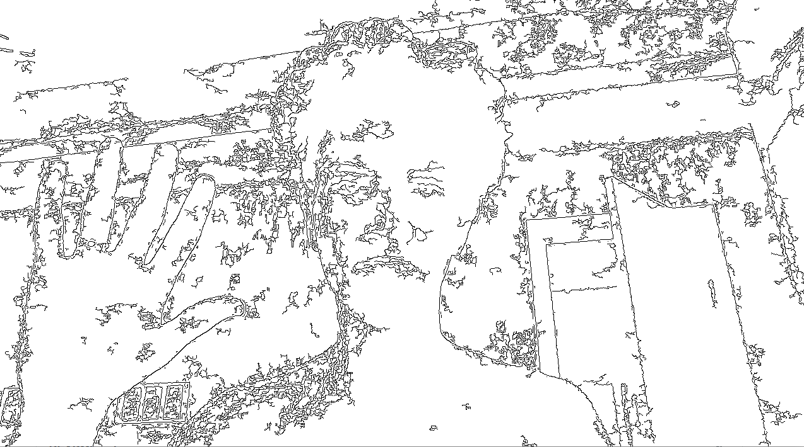
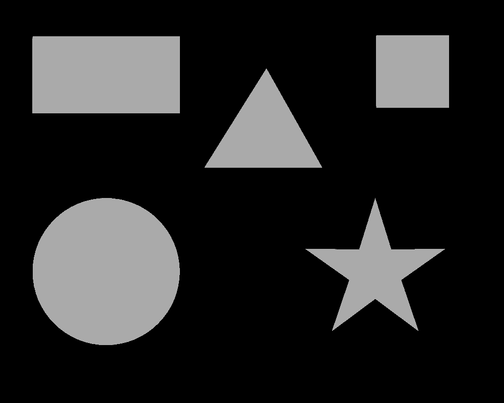
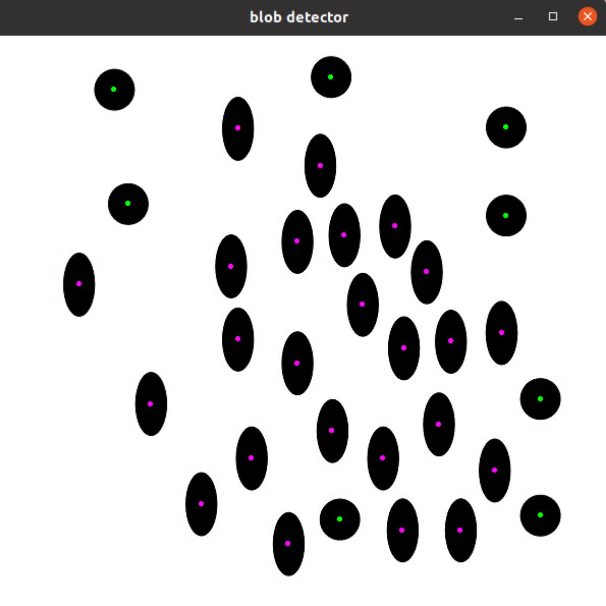
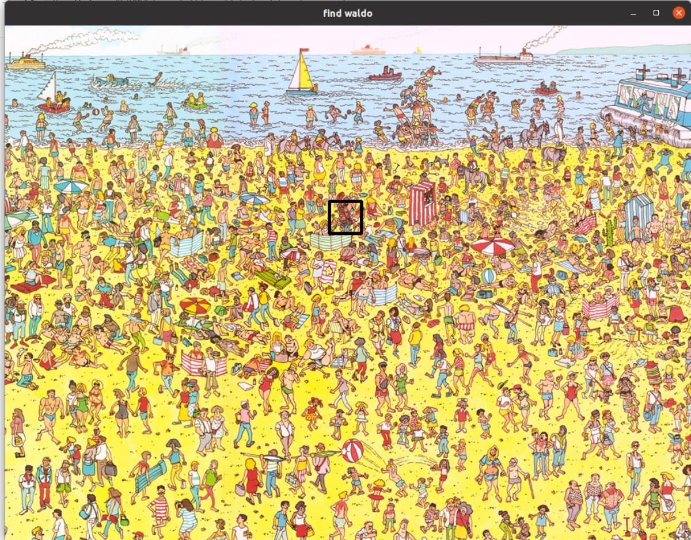

## OpenCV mini projects

rust cv projects from https://www.udemy.com/course/master-deep-learning-computer-visiontm-cnn-ssd-yolo-gans/ (originally in python)

## Demo

### Sketch filter

### Find contours of shapes

### Detect circles and ellipses

### Find waldo by template
